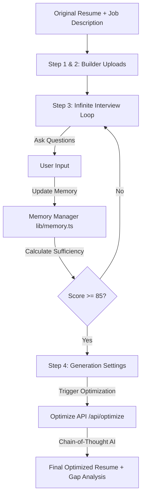

# CareerForge V3.0 — The AI Resume Authenticity Engine

CareerForge is an intelligent resume assistant that optimizes your resume for any job using AI.

## ✨ Features (MVP - Working Now)
- ✅ PDF resume upload
- ✅ Job description input
- ✅ Multi-provider AI (Claude, GPT-4, Gemini, Groq, Mistral)
- ✅ Resume optimization
- ✅ Match score (0-100)
- ✅ Missing skills analysis
- ✅ Cover letter generation
- ✅ Copy-to-clipboard
- ✅ Dark mode UI
- ✅ Responsive design

## 🔜 Coming Next (Phase 2)
- Smart questions
- Professional memory
- Advanced settings
- [etc]

CareerForge is an enterprise-grade, privacy-first career diagnostic platform designed to bridge the gap between static human resumes and complex modern Applicant Tracking Systems (ATS). 

Instead of generating generic, buzzword-heavy AI text that hiring managers easily flag, CareerForge uses a **local RAG-inspired Memory Loop** to extract quantitative metrics, skills, and business outcomes from candidates via a dynamic conversational interview.

---

## 🚀 Key Features

### 1. Persistent Candidate Memory
Features a client-managed Candidate Graph (`lib/memory.ts`) that extracts and saves core skills, metrics, goals, and gaps. The system preserves your profile data dynamically without storing sensitive data on remote backend databases.

### 2. Infinite Interview Loop
Powered by a conversational coaching engine (`/api/chat`). The AI reviews your uploaded CV and the target Job Description to highlight critical gaps. It interviews you dynamically, asking targeted questions to extract missing metrics, ending only when your profile's data sufficiency score reaches **85%+**.

### 3. Professional, High-Trust UI
Ditched glowing blobs and glassmorphic toy aesthetics for a clean, minimalist "Vercel-like" design system. Built with stark typography, a zinc/slate monochrome color palette, subtle patterns, and professional micro-interactions.

### 4. Chain-of-Thought (CoT) & Strict Guardrails
Generates resume adjustments with a hidden `<thought>` process, drastically reducing hallucinations. Enforces safety guardrails: the engine rejects off-topic chats, forbids metric inventing, and automatically filters out generic corporate buzzwords.

---

## 🛠️ Technology Stack

*   **Framework**: Next.js 16 (Turbopack)
*   **Styling**: TailwindCSS & Vanilla CSS Variables (`app/globals.css`)
*   **Language**: TypeScript (Strict Mode)
*   **AI Integration**: Multi-provider LLM interface (Anthropic, OpenAI, Google Gemini, Groq, Mistral)
*   **Document Processing**: Client-side base64 stream parsing (`pdf.js` & text extractors)

---

## ⚙️ Getting Started

### 1. Install Dependencies
```bash
npm install
```

### 2. Configure Your Keys
Launch CareerForge and head to `/settings` to configure your LLM providers. Paste your API keys (stored securely in your browser's local storage):
*   Groq API Key
*   Anthropic API Key
*   OpenAI API Key
*   Gemini API Key

### 3. Run Dev Server
```bash
npm run dev
```
Open [http://localhost:3000](http://localhost:3000) in your browser.

---

## 📂 Architecture Overview



For a detailed chronicle of modifications and design decisions, see [PROJECT_PROGRESS.md](./PROJECT_PROGRESS.md).
