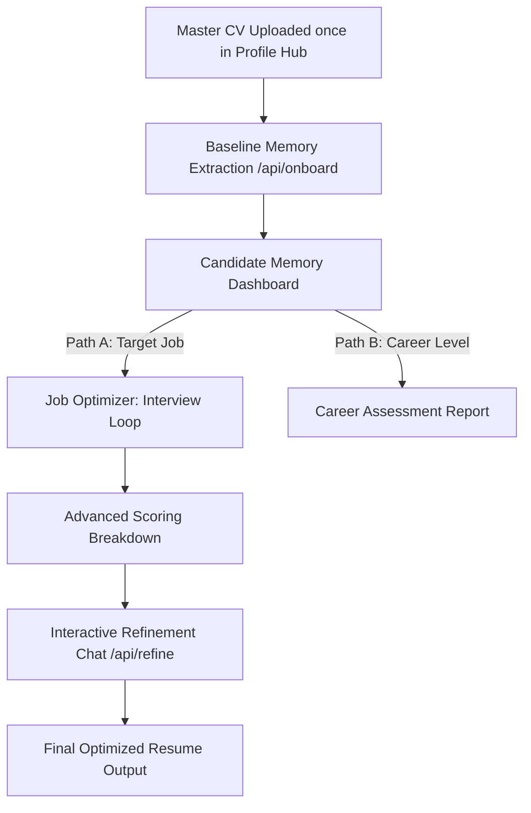

# CareerForge V4.0 — The AI Resume Authenticity Engine

CareerForge is an enterprise-grade, privacy-first career diagnostic platform designed to bridge the gap between static human resumes and complex modern Applicant Tracking Systems (ATS). 

Instead of generating generic, buzzword-heavy AI text that hiring managers easily flag, CareerForge uses a **local RAG-inspired Memory Loop** to extract quantitative metrics, skills, and business outcomes from candidates via a dynamic conversational interview.

---

## ✨ Features (V4.0 - Working Now)

### 1. Master CV Persistent Hub (`/profile`)
Upload your resume once. The system extracts your baseline history, saves it in local browser storage, and uses it for all future applications without forcing you to re-upload.

### 2. Candidate Memory Graph Visualizer
See your inferred Career Level (e.g. Entry, Senior, Executive), Core Skills, and Verifiable Metrics directly on a high-trust, visual memory dashboard. Talk directly to your personal Memory Manager via chat to dynamically edit or update your data.

### 3. Divergent Assessment Paths
*   **Path A (Job Target Optimization)**: Paste a job description. The AI compares it with your memory graph, asks dynamic follow-up questions to fill in missing details, and outputs an optimized resume.
*   **Path B (Career Level Assessor)**: The AI assesses your memory graph against current market demands, location, and salary goals to suggest suitable job titles, salary estimates, and flag roles you aren't ready for yet.

### 4. Advanced Multi-Dimensional Scoring
Provides an explainability layer for your score, breaking evaluations down into:
*   **ATS Parsability**: Formatting and structure readiness.
*   **Impact Density**: Quantitative metrics and output indicators.
*   **Keyword Alignment**: Contextual semantic keyword matches.

### 5. Interactive Post-Generation Refinement Chat
Allows real-time modification of optimized outputs via a conversation refinement box. Ask the AI to *"Make the summary shorter"* or *"Rewrite the project bullet points to be more technical,"* and it will apply adjustments instantly.

---

## 🛠️ Technology Stack

*   **Framework**: Next.js 16 (Turbopack)
*   **Styling**: TailwindCSS & Vanilla CSS Variables (`app/globals.css`)
*   **Language**: TypeScript (Strict Mode)
*   **AI Integration**: Multi-provider LLM interface (Anthropic, OpenAI, Google Gemini, Groq, Mistral)
*   **Document Processing**: Client-side base64 stream parsing (`pdf.js` & text extractors)

---

## ⚙️ Getting Started

### 1. Install Dependencies
```bash
npm install
```

### 2. Configure Your Keys
Launch CareerForge and head to `/settings` to configure your LLM providers. Paste your API keys (stored securely in your browser's local storage):
*   Groq API Key
*   Anthropic API Key
*   OpenAI API Key
*   Gemini API Key

### 3. Run Dev Server
```bash
npm run dev
```
Open [http://localhost:3000](http://localhost:3000) in your browser.

---

## 📂 Architecture Overview



For a detailed chronicle of modifications and design decisions, see [PROJECT_PROGRESS.md](./PROJECT_PROGRESS.md).
